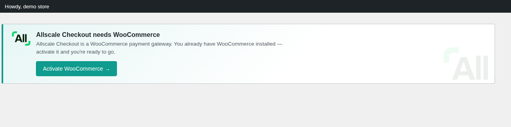
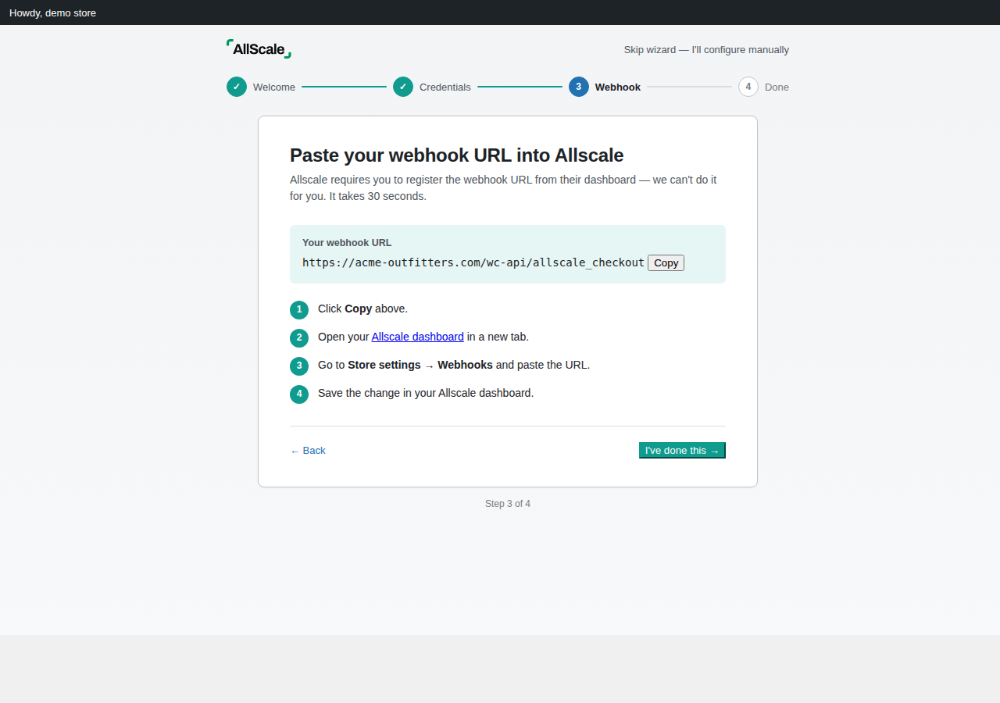
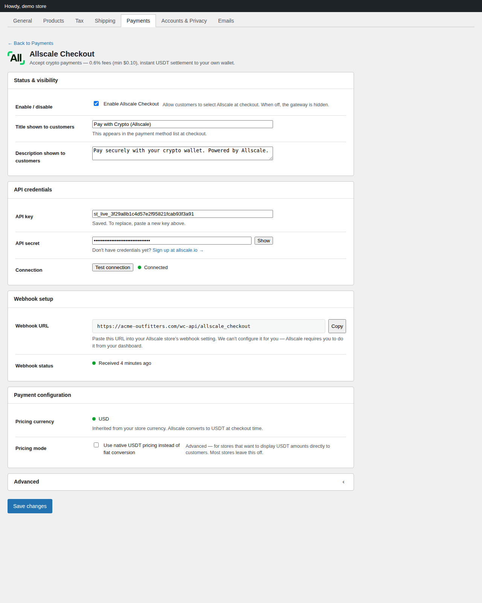
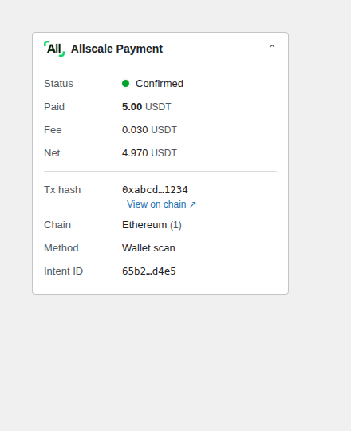

# Allscale Checkout for WordPress

A WordPress plugin (built as a WooCommerce payment gateway) that lets merchants accept crypto payments via [Allscale Checkout](https://allscale.io). Customers pay with a crypto wallet or their Allscale account; merchants receive **USDT stablecoin** directly to their own on-chain wallet. Funds settle in seconds and are never held by a third party.

**What is Allscale?** Allscale is a self-custody crypto payment processor. It hosts the checkout page where buyers pay, validates payments on-chain, and settles to the merchant's wallet. The merchant's API key + secret are scoped to a single Allscale "store" — Allscale itself never custodies funds.

> **Status:** pre-release (v0). Functional but lightly tested. Don't run on production stores yet.

---

## Why Allscale

- **Non-custodial.** Funds go straight to your wallet. No platform holds your money. No account freezes.
- **Low fees.** 0.6% per transaction with a $0.10 minimum (vs. ~3% on traditional processors).
- **Instant settlement.** On-chain USDT — no multi-day payout delays.
- **Permissionless setup.** Sign up, paste your credentials, start accepting payments.

---

## How it works

1. Customer places an order on your WooCommerce store and selects **Pay with Crypto (Allscale)**.
2. The plugin creates a checkout intent via the Allscale API.
3. Customer is redirected to a hosted Allscale checkout page to pay with their Allscale account or a crypto wallet (MetaMask, Trust Wallet, etc.).
4. Payment confirms on-chain. Allscale sends a signed webhook to your store and the order is marked paid.
5. Customer is redirected back to your "thank you" page; the plugin also double-checks the payment status as a safety net.

### Payment confirmation paths

The plugin confirms every payment via two independent paths so an order never gets stuck:

- **Webhook (server-to-server)** — Allscale's primary delivery channel. Verified with HMAC-SHA256, atomic nonce claims, and durable webhook-ID de-duplication. Works even if the customer closes their browser after paying.
- **Return-URL fallback** — When the customer lands on the thank-you page, the plugin asks the Allscale API for the current intent details and reconciles the order. Ensures the buyer sees "Payment confirmed" immediately even if the webhook is briefly delayed.

Both paths share a single status-mapping decision table and run inside an order lock, so they never duplicate notes or double-complete an order.

---

## What customers see

From the buyer's perspective:

1. **At checkout** — A "Pay with Crypto (Allscale)" option appears in the payment method list alongside whatever other gateways the merchant has enabled. Title, description, and icon are configurable.
2. **After clicking "Place order"** — The buyer is redirected to a hosted Allscale checkout page. They can pay using:
   - Their Allscale account
   - A connected wallet (MetaMask, Trust Wallet, WalletConnect-compatible wallets)
   - A wallet scan QR
3. **After paying** — The buyer is redirected back to the store's "thank you" page. The plugin renders a branded status block above the standard WooCommerce order details:
   - **Payment confirmed** (green) — payment is on-chain, order is complete
   - **Confirming your payment** (yellow) — transaction broadcast, awaiting confirmation. The page auto-refreshes up to 5 minutes total
   - **Payment didn't go through** (red) — failed, underpaid, canceled, or timed out

---

## Features

- Native WooCommerce payment gateway in `WooCommerce → Settings → Payments`.
- 4-step **setup wizard** on first activation (Welcome → Credentials → Webhook → Done) that walks merchants through the entire setup in ~3 minutes.
- **Test connection** button in settings — verifies credentials against Allscale's `/v1/test/ping` endpoint without saving.
- **Settings save validates credentials** before storing them; bad credentials are rejected with a specific reason (the API key isn't recognized, the API secret is incorrect, your server's IP is rejected by Allscale's allowlist, etc.).
- **HMAC-SHA256 request signing and webhook verification** (timing-safe `hash_equals` comparison, nonce de-duplication).
- **Allscale Payment meta box** on each order: status pill, paid / fee / net breakdown in USDT, tx hash with block-explorer link, payment-method type, chain badge, intent ID.
- **Branded thank-you page status block** for customers — confirmed / pending (with auto-refresh) / failed variants.
- **Webhook health observation** — last-received timestamp on the settings page, first-webhook celebration notice, stale-webhook warning after 7 days.
- **Native USDT pricing mode** as an opt-in setting (sends `stable_coin` instead of `currency` to skip fiat conversion — useful for crypto-first stores).
- **Branded "needs WooCommerce" notice** with one-click Install or Activate CTA if WooCommerce isn't installed yet.
- HPOS (High-Performance Order Storage) compatible.
- Block-based checkout compatible.
- Full i18n with text domain `allscale-checkout`.

---

## Supported networks and currencies

**Settlement coin:** USDT (Tether) on the following EVM chains. The plugin renders a block-explorer link in the order meta box for each:

| Chain | Chain ID | Explorer |
|---|---|---|
| Ethereum | 1 | etherscan.io |
| Optimism | 10 | optimistic.etherscan.io |
| BNB Chain | 56 | bscscan.com |
| Polygon | 137 | polygonscan.com |
| Base | 8453 | basescan.org |
| Arbitrum | 42161 | arbiscan.io |

The actual chain a customer pays on is determined by them at checkout-time on the Allscale-hosted page. The plugin records whichever chain the on-chain transaction was confirmed on.

**Store pricing currencies** (these are the WooCommerce store currencies Allscale will FX-convert to USDT for the customer):

- USD, EUR, GBP, CAD, AUD, JPY, CNY, SGD, HKD

If your store currency isn't in this list, the plugin shows a warning in settings. You have two options:
- Change your WooCommerce store currency to a supported one, or
- Enable **native USDT pricing** in the plugin settings (prices are sent to Allscale as USDT directly, no FX conversion).

---

## Limitations

- **No automatic refunds.** Allscale is non-custodial — funds settle directly to your wallet, so there's nothing for the plugin to refund. Refund manually from your wallet and update the WC order status. See [Refunds](#refunds).
- **No subscriptions / recurring payments.** The Allscale API only exposes one-shot checkout intents. WC Subscriptions integration is not supported.
- **No multi-currency selection at checkout.** The store currency is fixed in WC settings; the customer can't pick a different one. The customer DOES pick which crypto wallet / chain to pay from on the Allscale-hosted page.
- **Webhook URL is dashboard-only.** The Allscale API doesn't expose any endpoint to register webhook URLs programmatically — the merchant must paste the URL into their Allscale dashboard manually.
- **Minimum payment: 0.10 USDT** (or its equivalent in the store currency after FX). Orders below this are rejected by the API.

---

## Requirements

- WordPress 5.8+
- WooCommerce 6.0+
- PHP 7.4+
- An [Allscale account](https://allscale.io) with Commerce enabled and a store configured with your USDT receiving wallet

> **First time?** Sign up at [allscale.io](https://allscale.io). Allscale is non-custodial, charges 0.6% per transaction (minimum $0.10), and settles instantly as USDT to your own wallet.

---

## Requires WooCommerce

Allscale Checkout is a **WooCommerce payment gateway** — it can't function without WooCommerce installed and active. If you activate this plugin on a site that doesn't have WooCommerce, the plugin won't crash; instead it shows a branded notice with a one-click action to install or activate WooCommerce.



Two states are handled:

- **WooCommerce isn't installed** — the CTA reads "Install WooCommerce" and links to WordPress's plugin installer (one click installs from WP.org with a valid nonce).
- **WooCommerce is installed but inactive** — the CTA reads "Activate WooCommerce" and links to the plugin activation action.

Once WooCommerce is active, the notice disappears and the plugin proceeds normally to its setup wizard.

---

## Installation

1. Download the latest release ZIP from [GitHub releases](https://github.com/allscale-io/allscale-wordpress-plugin/releases) (or `archive/refs/heads/main.zip` for the current dev tip).
2. In your WordPress admin, go to **Plugins → Add New → Upload Plugin**, choose the ZIP, click **Install Now**, then **Activate**.
3. If WooCommerce isn't already installed and active, the notice above will guide you through that step first.
4. After activation, the plugin redirects you to a 4-step setup wizard. If you skip it, you can configure manually under **WooCommerce → Settings → Payments → Allscale Checkout**.

The wizard's third step is the one most worth pausing on — it spells out the only step Allscale can't automate, namely pasting the plugin's webhook URL into your Allscale dashboard:



---

## Setup

The setup wizard walks through all three steps below in one flow. You can also do them manually.

Once everything is wired up, the gateway settings page looks like this — green pills for verified credentials and a healthy webhook, with the webhook URL ready to copy and the rest of the configuration grouped into focused sections:



### 1. Get your Allscale credentials

1. Create an account at [allscale.io](https://allscale.io).
2. Enable **Allscale Commerce** in your dashboard.
3. Create a **store** and configure your USDT receiving wallet address.
4. Generate an **API key** and **API secret** (the secret is shown only once — save it).

### 2. Configure the plugin

1. Go to **WooCommerce → Settings → Payments → Allscale Checkout**.
2. Paste your **API key** and **API secret**.
3. Click **Test connection** to verify the credentials. You'll see a green "Connected" pill or a specific error explaining what's wrong (wrong key, wrong secret, IP blocked, etc.).
4. Click **Save changes**. The plugin validates credentials again on save and rejects the save with the specific error if anything has changed.

> **Testing without real payments?** Sandbox mode has been retired. Create a **test store** in your Allscale dashboard and use that store's credentials — both production and test stores share the same `openapi.allscale.io` base URL.

### 3. Configure the webhook

1. Copy the webhook URL shown in the plugin settings. It looks like:
   ```
   https://yoursite.com/wc-api/allscale_checkout
   ```
2. In your Allscale dashboard, paste this URL into your store's webhook setting.
3. The Allscale API does not expose webhook management endpoints — this step has to happen in the dashboard. After your first successful payment, the plugin will show a **"First webhook received"** confirmation in the WordPress admin.

The settings page surfaces the **webhook status** at all times:

- **Never received yet** (gray) — waiting for the first delivery
- **Received N minutes ago** (green) — healthy
- **No webhook in N days** (yellow) — stale; check that the URL is still configured on Allscale's side, your firewall isn't blocking POSTs, and Allscale hasn't paused delivery for this store

---

## Order statuses

These are the WooCommerce order states you'll see, and what they mean in Allscale terms:

| WC status | What it means in Allscale |
|---|---|
| `pending` | Intent created, customer hasn't paid yet (or is still on the Allscale checkout page) |
| `on-hold` | Allscale needs manual review (`PENDING_MANUAL_OPERATION`), or the payment was underpaid (`UNDERPAID`), or the amount mismatched what we sent |
| `processing` / `completed` | Payment confirmed on-chain (`CONFIRMED`). WooCommerce moves the order to `completed` automatically for downloadable/virtual products and `processing` otherwise |
| `cancelled` | Customer canceled on the Allscale page (`CANCELED`), or the intent timed out (`TIMEOUT`) |
| `failed` | Payment failed (`FAILED`) or was rejected by Allscale's compliance check (`REJECTED`) |
| `refunded` | You manually refunded the customer from your wallet and updated the WC status |

Every Allscale state transition writes an order note with a timestamp + reason so the merchant can audit the lifecycle.

Each Allscale order also gets a dedicated **Allscale Payment** meta box in the WooCommerce order screen — the same data the webhook + return-URL fallback persisted to order meta, laid out for at-a-glance auditing:



---

## Refunds

Allscale is **non-custodial** — funds settle directly to your wallet, never to a platform account. Automatic refunds via WooCommerce are therefore not supported. To refund a customer:

1. Send the refund amount back to the customer manually from your wallet.
2. In WooCommerce, update the order status to **Refunded**.

If a refund is in-progress on the Allscale side (status `SEND_BACK`), the plugin records that as an order note but doesn't auto-update the WC status — the merchant is the final source of truth on refunds.

---

## Abandoned orders

If a customer starts checkout but never completes payment, the order stays as **Pending payment**. WooCommerce automatically cancels unpaid pending orders based on your **Hold stock** setting at *WooCommerce → Settings → Products → Inventory → Hold stock (minutes)*. The default is 60 minutes. After that, the order is cancelled and any reserved stock is released — no action needed from you.

---

## Troubleshooting

### "Customer says they paid but the order is still pending"

Two paths confirm payments; one of them should fire within seconds of the on-chain confirmation. If neither has:

1. Check the **Webhook status** on the settings page. If it's gray ("Never received yet") or stale, your webhook URL probably isn't configured correctly on Allscale's side. Re-copy from the plugin settings and re-paste into the Allscale dashboard.
2. Check the order's Allscale Payment meta box for the intent ID. Look it up in your Allscale dashboard to see the on-chain status.
3. Enable **Debug logging** in the plugin's Advanced settings, reproduce the order, and check **WooCommerce → Status → Logs** under source `allscale-checkout` for what went wrong.

### "Test connection fails with error 20002"

20002 means the API secret doesn't match the key on Allscale's side. Re-copy the secret from your Allscale dashboard (it's shown only once when generated — if you've lost it, regenerate the key pair).

### "Test connection fails with 'IP forbidden' (30001)"

Your server's outbound IP isn't on Allscale's allowlist. Find your IP (e.g., `curl ifconfig.me` from a server shell) and add it in your Allscale dashboard's API settings.

### "My store currency isn't supported"

Allscale supports 9 fiat currencies: USD, EUR, GBP, CAD, AUD, JPY, CNY, SGD, HKD. If yours isn't in the list, either:
- Change your WooCommerce store currency in *Settings → General*, or
- Enable **Use native USDT pricing** in the plugin's Payment configuration section — prices are sent to Allscale as USDT directly (no FX conversion). Your displayed prices stay in your store currency but represent USDT amounts (e.g. "5.00" means 5 USDT).

### Reading the logs

When **Debug logging** is enabled, the plugin writes to WooCommerce's logger under source `allscale-checkout`. Read them at *WooCommerce → Status → Logs* (select the `allscale-checkout` source from the dropdown). Logged events include:

- Every API call with method, path, HTTP status, latency, and Allscale `request_id`
- Webhook verification failures with the offending webhook ID
- Status mapper transitions with the order ID and the Allscale → WC mapping

---

## Updating the plugin

Until we're on the WordPress.org plugin directory, updates are manual:

1. Download the new release ZIP from [GitHub releases](https://github.com/allscale-io/allscale-wordpress-plugin/releases).
2. Replace the existing plugin folder, or use a tool like *WP-CLI* (`wp plugin install /path/to/new.zip --force`) or the *Easy Theme and Plugin Upgrades* plugin.

Your settings, credentials, and order meta are preserved across upgrades. The plugin runs idempotent migrations on each activation/upgrade — if you're coming from the legacy 0.1.x community beta, the first request after upgrade clears the obsolete `environment` setting and queues a one-time notice explaining sandbox retirement.

---

## Security model

- **API secret is stored in the WC settings option** (`woocommerce_allscale_checkout_settings`) in the WP `options` table. It's transmitted to the admin form as a password input and revealable with the "Show" button. Any admin user with `manage_woocommerce` can read it — same as Stripe, PayPal, and other WC payment gateways.
- **All API signing happens server-side.** The secret never reaches frontend / customer-side code.
- **Outbound requests** to `https://openapi.allscale.io` are signed with HMAC-SHA256 over a canonical string of `METHOD / PATH / QUERY / TIMESTAMP / NONCE / BODY_SHA256`. Timestamps are required within ±10 minutes of Allscale's server time (configurable per-store, can be tightened).
- **Inbound webhooks** are verified the same way, with a leading `allscale:webhook:v1` line. Nonces are de-duplicated for 10 minutes; replays are rejected. The body's `webhook_id` field is verified against the `X-Webhook-Id` header.
- **No customer payment data ever touches your server.** The customer enters wallet addresses / scans QR codes on the Allscale-hosted checkout page; your server only sees the post-payment metadata (tx hash, paid amount, chain ID).

---

## Architecture

For implementation details — module-by-module design, the dependency graph, naming conventions, migration plan, and what's deliberately out of scope — see [`docs/architecture.md`](docs/architecture.md).

For the UI specification driving the admin design (settings page, meta box, notices, wizard), see [`docs/design-brief.md`](docs/design-brief.md).

---

## Development

```bash
git clone https://github.com/allscale-io/allscale-wordpress-plugin.git
cd allscale-wordpress-plugin

# For local development, symlink into your WP plugins directory:
ln -s "$(pwd)" /path/to/wordpress/wp-content/plugins/allscale-checkout
```

The plugin uses PHP namespaces (`Allscale\Checkout\`) and explicit `require_once` (no autoloader) so the file count stays small and traceable. There's no build step — PHP, vanilla JS, and a single CSS file under `assets/`.

### Extending the plugin

Two filter / action hooks are exposed for third-party code:

- **`allscale_checkout_intent_request_payload`** (filter) — Modify the JSON body sent to `POST /v1/checkout_intents/` before signing. Receives the assembled payload array and the `WC_Order`. Use this to add custom metadata, override `extra`, or inject store-specific fields.
- **`allscale_checkout_webhook_after_process`** (action) — Fires after the plugin has applied a verified Allscale webhook to the order. Receives the `WC_Order` and the decoded webhook payload array. Use this to trigger custom side effects (notify Slack, sync to an external system, etc.).
- **`allscale_checkout_duplicate_payment_detected`** (action) — Fires when a different Allscale intent confirms after the order is already paid. Receives the `WC_Order` and normalized payment context so reconciliation tooling can alert the merchant.

### Order meta keys

If you query or display Allscale data elsewhere, the canonical meta keys are:

| Key | Meaning |
|---|---|
| `_allscale_intent_id` | Allscale checkout intent ID |
| `_allscale_prior_intent_id` | Superseded intent IDs, one meta row per ID |
| `_allscale_checkout_url` | Checkout URL for safe intent reuse |
| `_allscale_intent_amount_cents` | Order amount bound to the current intent |
| `_allscale_settled_intent_id` | Intent that first completed the order |
| `_allscale_duplicate_payment_intent_id` | Additional confirmed intents requiring reconciliation |
| `_allscale_processed_webhook_id` | Durable webhook idempotency records |
| `_allscale_status` | Latest Allscale status integer (see `Status_Codes`) |
| `_allscale_tx_hash` | On-chain transaction hash |
| `_allscale_chain_id` | EIP-155 chain ID |
| `_allscale_payment_method_type` | 1=wallet scan, 2=WalletConnect, 3=Allscale Pay |
| `_allscale_coin_symbol` | Settlement coin symbol (e.g., "USDT") |
| `_allscale_amount_coins` | Stable-coin amount paid (decimal string) |
| `_allscale_actual_paid_amount` | Final on-chain amount (decimal string) |
| `_allscale_service_fee_amount` | Allscale's fee (decimal string) |
| `_allscale_net_income_amount` | Amount that reaches your wallet (decimal string) |

Legacy `_allscale_checkout_intent_id` (from the prior 0.1.x community beta) is dual-read for backward compatibility on in-flight orders.

---

## License

GPLv2 or later — see [LICENSE](LICENSE) for details.

---

## Links

- [Allscale](https://allscale.io)
- [Allscale API documentation](https://docs.allscale.io/allscale-checkout/getting-started)
- [Allscale Checkout integration guide](https://github.com/allscale-io/allscale-checkout-skill) (for AI coding agents)
- [WooCommerce Payment Gateway API](https://woocommerce.com/document/payment-gateway-api/)
- [GitHub repo](https://github.com/allscale-io/allscale-wordpress-plugin)
